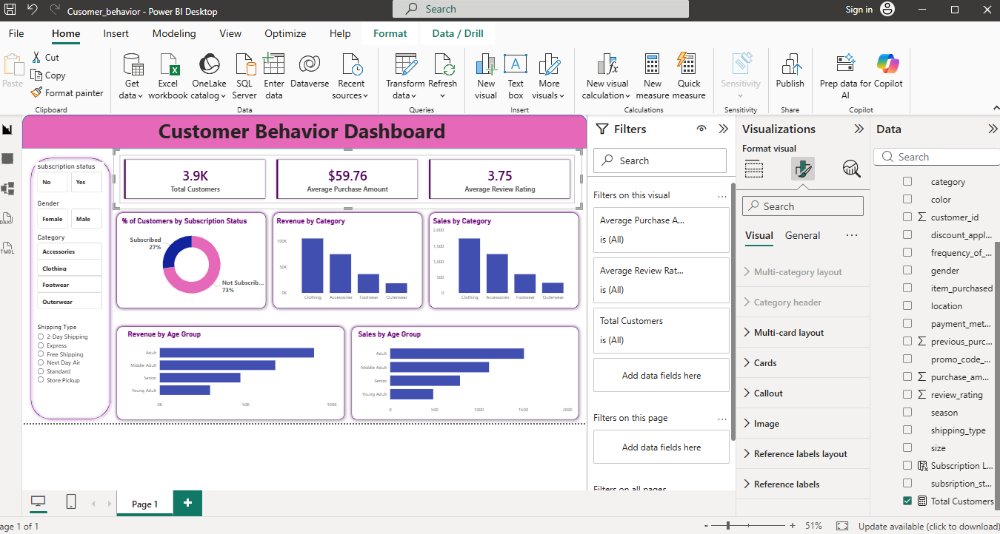

# Customer-Behavior-Analysis
Power BI, SQL &amp; Python Customer Behavior Dashboard Project

📊 Customer Behavior Analysis Dashboard
📌 Overview

This project analyzes 3,900+ customer transaction records to understand purchasing behavior, revenue patterns, and subscription trends. The objective was to transform raw transactional data into meaningful business insights using SQL, Python, and Power BI.
The project follows a complete end-to-end data analytics workflow — from data cleaning and SQL querying to dashboard development and reporting.

📂 Dataset

Records: 3,900+ customer transactions
Data Type: Structured transactional dataset
Fields Included: Customer ID, Purchase Amount, Subscription Status, Product Category, Transaction Date, etc.
Data was cleaned and validated before analysis

🛠 Tools & Technologies

Python (Pandas, NumPy) – Data cleaning & preprocessing
SQL – Data extraction, joins, aggregations
Power BI – Dashboard development & DAX calculations
Excel – Initial validation and formatting

📊 Dashboard Features

The interactive Power BI dashboard includes:
📌 Total Revenue KPI

📌 Average Purchase Value

📌 Subscription Rate

📌 Monthly Revenue Trends

📌 Customer Segmentation Analysis

📌 Interactive slicers for dynamic filtering

The dashboard is designed to provide quick and actionable insights for business stakeholders.

📈 Key Insights

Identified high-value customer segments contributing the most revenue
Analyzed repeat purchase behavior patterns
Observed revenue growth trends over time
Improved KPI visibility through interactive reporting

🚀 How to Run the Project

Clone this repository
Load the dataset into Python for cleaning and preprocessing
Import cleaned data into SQL database
Execute SQL queries for analysis
Connect Power BI to the processed dataset
Open the .pbix file to explore the interactive dashboard

🎯 Learning Outcomes

End-to-end data analytics workflow implementation
Practical use of SQL joins, GROUP BY, and aggregations
Dashboard design and KPI development
Converting raw data into business insights

## 📊 Dashboard Preview

